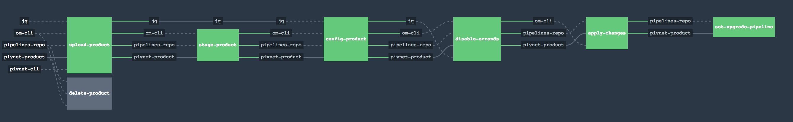

PCF product tiles Concourse Pipelines:
---

> **CAUTION:** Pivotal does not provide support for these pipelines.
> If you find anything broken, then please submit a PR.

---

### Pipelines available in this repository are:

This repository provides the pipelines for the products listed in the following table.

| PIVOTAL PRODUCT NAME | VERSION | PIPELINE LOCATION |
| --- | --- | --- |
| [Isolation Segments](https://network.pivotal.io/products/p-isolation-segment) | 2.1.x | [Isolation Segments Installation](./pipelines/tiles/isolation-segment)
| [RabbitMQ](https://network.pivotal.io/products/p-rabbitmq) | 1.13.x | [RabbitMQ Installation](./pipelines/tiles/rabbitmq)
| [Redis](https://network.pivotal.io/products/p-redis) | 1.12.x | [Redis Installation](./pipelines/tiles/redis)
|	[Spring Cloud Services](https://network.pivotal.io/products/p-spring-cloud-services) | 1.5.x | [Spring Cloud Services Installation](./pipelines/tiles/spring-cloud-services)
| [MySQL-v1](https://network.pivotal.io/products/p-mysql) | 1.10.x | [MySQL-v1 Installation](./pipelines/tiles/mysql) [**TO BE DISCONTINUED**]
|	[MySQL-v2](https://network.pivotal.io/products/pivotal-mysql) | 2.2.x | [MySQL-v2 Installation](./pipelines/tiles/mysql-v2)
|	[PCF Metrics](https://network.pivotal.io/products/apm) | 1.4.x | [PCF Metrics Installation](./pipelines/tiles/pcf-metrics)
| [Healthwatch](https://network.pivotal.io/products/p-healthwatch) | 1.2.x | [Healthwatch Installation](./pipelines/tiles/healthwatch)
| [Splunk Nozzle](https://network.pivotal.io/products/splunk-nozzle)| 1.0.x | [Splunk Nozzle Installation](./pipelines/tiles/splunk-nozzle)
| [New Relic Nozzle](https://network.pivotal.io/products/nr-firehose-nozzle) | 1.0.x | [New Relic Nozzle Installation](./pipelines/tiles/newrelic-nozzle)
| [New Relic Service Broker](https://network.pivotal.io/products/p-new-relic) | 1.12.x | [New Relic Service Broker Installation](./pipelines/tiles/newrelic-service-broker)
| [Spring Cloud Data Flow](https://network.pivotal.io/products/p-dataflow) | 1.0.x | [Spring Cloud Data Flow Installation](./pipelines/tiles/spring-cloud-dataflow)
|	[Single Signon](https://network.pivotal.io/products/pivotal_single_sign-on_service) | 1.6.x | [Single Signon Installation](./pipelines/tiles/single-signon)
|	[AppDynamics Service Broker](https://network.pivotal.io/products/p-appdynamics) | 4.4.135 | [AppDynamics Service Broker Installation](./pipelines/tiles/appdynamics)
|	[Credhub Service Broker](https://network.pivotal.io/products/credhub-service-broker) | 1.0.2 | [Credhub Service Broker Installation](./pipelines/tiles/credhub-service-broker)
|	Upgrade Buildpacks | any | [Upgrade Buildpacks](./pipelines/upgrade-buildpack)
|	Upgrade Tile | any | [Upgrade Tile](./pipelines/upgrade-tile)

---
### Following is an example on how to `fly` a pipeline:

```
>	fly -t concourse-[ENV] login -c https://<CONCOURSE-URL> -k
>	fly -t concourse-[ENV] set-pipeline -p install-healthwatch -c ./pipelines/tiles/healthwatch/pipeline.yml -l ./pipelines/tiles/healthwatch/params.yml
>	fly -t concourse-[ENV] unpause-pipeline -p install-healthwatch
```



Once the pipeline executes successfully, there will be a new pipeline set in the concourse based on the concourse information provided in the params file of the install pipeline. Make sure your concourse instance requires authentication, failing which the `set-upgrade-pipeline` job will fail.
