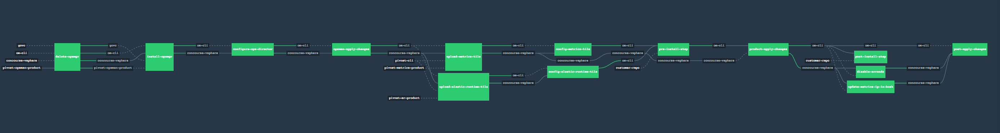

**To use this pipeline create the params.yml file with the following variables**

```
pivnet_token: <YOUR-PIVNET-TOKEN>
github_token: <YOUR-GITHUB-TOKEN>

vcenter_host: <VCENTER-HOST-OR-IP>
vcenter_usr: <VCENTER-SERVICE-USR>
vcenter_pwd: <VCENTER-SERVICE-USR-PWD>
vcenter_data_center: <VCENTER-DATA-CENTER-TO-DEPLOY>

## Ops Manager installation meta data
om_data_store: <DATA-STORE-TO-DEPLOY-OPS-MANAGER>
om_host: <DESIRED-OPS-MANAGER-HOST-NAME>
om_usr: <DESIRED-OPS-MANAGER-USR>
om_pwd: <DESIRED-OPS-MANAGER-PWD>
om_ssh_pwd: <DESIRED-OPS-MANAGER-SSH-PWD>
om_decryption_pwd: <DESIRED-OPS-MANAGER-DECRYPTION-PWD>
om_ntp_servers: <OPS-MANAGER-NTP-SERVERS>
om_dns_servers: <OPS-MANAGER-DNS-SERVERS>
om_gateway: <OPS-MANAGER-NETWORK-GATEWAY>
om_netmask: <OPS-MANAGER-NETWORK-MASK>
om_ip: <DESIRED-OPS-MANAGER-IP>

om_vm_network: <OPS-MANAGER-NETWORK-NAME>
om_vm_name: <OPS-MANAGER-VM-NAME>
om_resource_pool: <OPS-MANAGER-RESOURCE-POOL-PATH>

disk_type: "<thick/thin>"
om_vm_power_state: <true/false>

storage_names: <PCF-STORAGE-NAMES>

## AZ configuration for Ops Director
az_1_name: <infra-az-name>
az_2_name: <deployment-az-name>
az_3_name: <services-az-name>

az_1_cluster_name: <vcenter-infra-cluster-name>
az_2_cluster_name: <vcenter-deployment-cluster-name>
az_3_cluster_name: <vcenter-services-cluster-name>

az_1_rp_name: <vcenter-infra-resource-pool-name>
az_2_rp_name: <vcenter-deployment-resource-pool-name>
az_3_rp_name: <vcenter-services-resource-pool-name>

ntp_servers:
ops_dir_hostname:

## Network configuration for Ops Director
infra_network_name: "INFRASTRUCTURE"
infra_vsphere_network:
infra_nw_cidr:
infra_excluded_range:
infra_nw_dns:
infra_nw_gateway:
infra_nw_azs:

deployment_network_name: "DEPLOYMENT"
deployment_vsphere_network:
deployment_nw_cidr:
deployment_excluded_range:
deployment_nw_dns:
deployment_nw_gateway:
deployment_nw_azs:

services_network_name: "SERVICES"
services_vsphere_network:
services_nw_cidr:
services_excluded_range:
services_nw_dns:
services_nw_gateway:
services_nw_azs:

dynamic_services_network_name: "DYNAMIC-SERVICES"
dynamic_services_vsphere_network:
dynamic_services_nw_cidr:
dynamic_services_excluded_range:
dynamic_services_nw_dns:
dynamic_services_nw_gateway:
dynamic_services_nw_azs:


ert_singleton_job_az:

loggregator_endpoint_port:

## Syslog endpoint configuration goes here
syslog_host:
syslog_port:
syslog_protocol:

## Wildcard domain certs go here
ssl_cert:
ssl_private_key:

disable_http_proxy: <true/false>

## TCP routing and routing services
tcp_routing: <enable/disable>
tcp_routing_ports:
route_services: <enable/disable>
ignore_ssl_cert_verification: <true/false>

## SMTP configuration goes here
smtp_from:
smtp_address:
smtp_port:
smtp_user:
smtp_pwd:
smtp_auth_mechanism:

## LDAP Configuration goes here
ldap_url:
ldap_user:
ldap_pwd:
search_base:
search_filter:
group_search_base:
group_search_filter:
mail_attribute_name:
first_name_attribute:
last_name_attribute:

## Deployment domain names
system_domain:
apps_domain:

skip_cert_verify: <true/false>

## Static IP's for the following jobs
ha_proxy_ips:
router_static_ips:
tcp_router_static_ips:
ssh_static_ips:

## Target email address to receive mysql monitor notifications
mysql_monitor_email:

## Default resource configuration
consul_server_instances: 1
nats_instances: 1
etcd_tls_server_instances: 1
nfs_server_instances: 1
mysql_proxy_instances: 1
mysql_instances: 1
backup_prepare_instances: 0
ccdb_instances: 0
uaadb_instances: 0
uaa_instances: 1
cloud_controller_instances: 1
ha_proxy_instances: 0
router_instances: 1
mysql_monitor_instances: 1
clock_global_instances: 1
cloud_controller_worker_instances: 1
diego_database_instances: 1
diego_brain_instances: 1
diego_cell_instances: 3
doppler_instances: 1
loggregator_traffic_controller_instances: 1
tcp_router_instances: 1

## JMX Bridge tile configuration goes here
jmx_admin_usr:
jmx_admin_pwd:
jmx_security_logging: <true/false>
jmx_use_ssl: <true/false>

```

Now you can execute the following commands:

-	`fly -t lite login`
-	`fly -t lite set-pipeline -p pcf -c new-setup/pipeline.yml -l params.yml`
-	`fly -t lite unpause-pipeline -p pcf`


