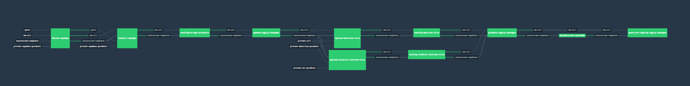

**To use this pipeline create the params.yml file with the following variables**

```
pivnet_token: <YOUR-PIVNET-TOKEN>
github_token: <YOUR-GITHUB-TOKEN>
github_private_key: <YOUR-GITHUB-PRIVATE-KEY>

vcenter_host: <VCENTER-HOST-OR-IP>
vcenter_usr: <VCENTER-SERVICE-USR>
vcenter_pwd: <VCENTER-SERVICE-USR-PWD>
vcenter_data_center: <VCENTER-DATA-CENTER-TO-DEPLOY>

om_data_store: <DATA-STORE-TO-DEPLOY-OPS-MANAGER>
ops_mgr_host: <DESIRED-OPS-MANAGER-HOST-NAME>
ops_mgr_usr: <DESIRED-OPS-MANAGER-USR>
ops_mgr_pwd: <DESIRED-OPS-MANAGER-PWD>
ops_mgr_ssh_pwd: <DESIRED-OPS-MANAGER-SSH-PWD>
om_decryption_pwd: <DESIRED-OPS-MANAGER-DECRYPTION-PWD>
om_ntp_servers: <OPS-MANAGER-NTP-SERVERS>
om_dns_servers: <OPS-MANAGER-DNS-SERVERS>
om_gateway: <OPS-MANAGER-NETWORK-GATEWAY>
om_netmask: <OPS-MANAGER-NETWORK-MASK>
om_ip: <DESIRED-OPS-MANAGER-IP>

om_vm_network: <OPS-MANAGER-NETWORK-NAME>
om_vm_name: <OPS-MANAGER-VM-NAME>
om_resource_pool: <OPS-MANAGER-RESOURCE-POOL-PATH>
disk_type: "thick"
om_vm_power_state: true

storage_names: <PCF-STORAGE-NAMES>
network_name: <PCF-NETWORK-NAME>
vm_network:
deployment_nw_cidr:
excluded_range:
deployment_nw_dns:
deployment_nw_gateway:

az_1_name:
az_2_name:
az_3_name:

az_1_cluster_name:
az_2_cluster_name:
az_3_cluster_name:

az_1_rp_name:
az_2_rp_name:
az_3_rp_name:

ntp_servers:
ops_dir_hostname:
loggregator_endpoint_port:
syslog_host:
syslog_port:
syslog_protocol:
ssl_cert:
ssl_private_key:
disable_http_proxy:
tcp_routing:
tcp_routing_ports:
route_services:
ignore_ssl_cert_verification:
smtp_from:
smtp_address:
smtp_port:
smtp_user:
smtp_pwd:
smtp_auth_mechanism:
ldap_url:
ldap_user:
ldap_pwd:
search_base:
search_filter:
group_search_base:
group_search_filter:
mail_attribute_name:
first_name_attribute:
last_name_attribute:
system_domain:
apps_domain:
ha_proxy_ips:
skip_cert_verify:
router_static_ips:
mysql_monitor_email:
tcp_router_static_ips:
ssh_static_ips:

jmx_admin_usr:
jmx_admin_pwd:
jmx_security_logging: true
jmx_use_ssl: false

```

Now you can execute the following commands:

* `fly -t lite login`
* `fly -t lite set-pipeline -p pcf -c new-setup/pipeline.yml -l params.yml`
* `fly -t lite unpause-pipeline -p pcf`


