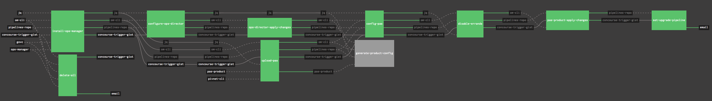

### PCF Installation on vSphere Only

-	This pipeline is based on the [vSphere reference architecture](http://docs.pivotal.io/pivotalcf/1-10/refarch/vsphere/vsphere_ref_arch.html)
-	Pre-requisites for using this pipeline are:
	-	4 Networks (One for each of the Infrastructure, Deployment, Services and Dynamic Services)
	-	3 AZ's (vSphere Clusters and/or Resource Pools)
	- Shared storage (Ephemeral and Persistent)
	-	DNS with wildcard domains

**IMPORTANT: If the above vSphere settings do not match your setup, please fork this repository and modify the `tasks/config-opsdir/task.sh` and update the networks and AZ's JSON accordingly**

